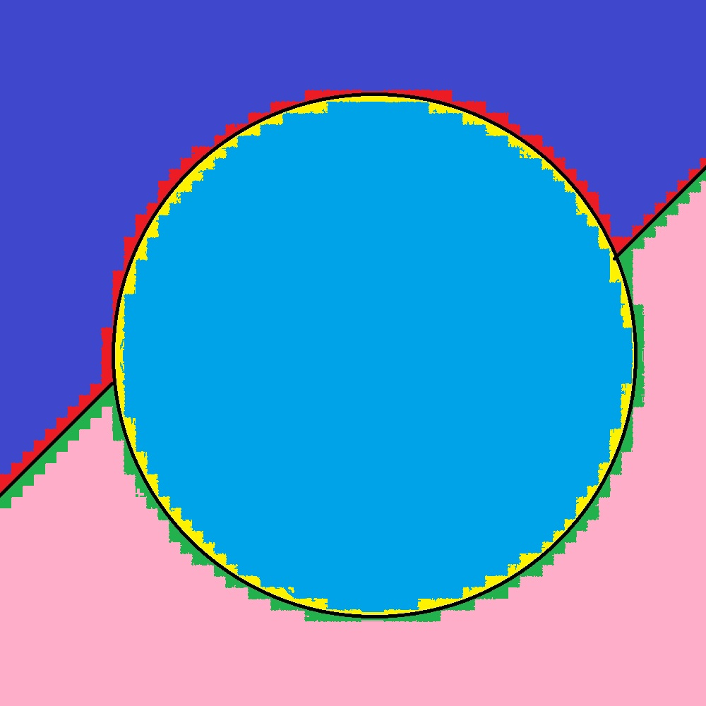
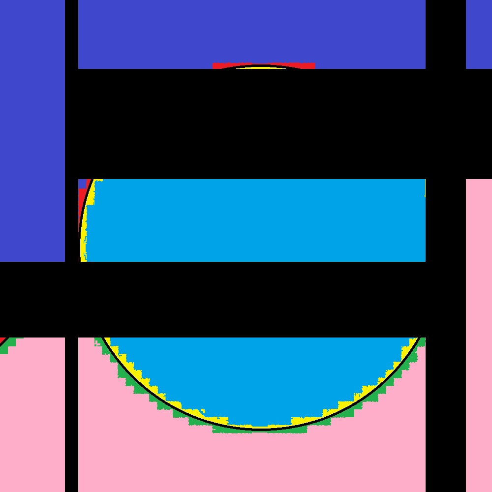

===============
Tabele i obrazy
===============

Wprowadzenie do długiego dokumentu tekstowego jest zwykle przygotowaniem. Autor musi zdecydować, które informacje są niezbędne, a które mogą pełnić funkcję wypełnienia przestrzeni. Tu też wkrótce pojawią się tabele, diagramy, ilustracje, które wniosą porządek i wizualną strukturę.

   =====  ===== =============
     A    not A random number
   =====  ===== =============
   False  True	2
   True   False 5
   =====  ===== =============

Każdy wiersz dokumentu, każda kolumna tabel jest potencjalnym nośnikiem informacji, ale też refleksją nad tym, jak informacje są ułożone. Czasem sama obecność tabeli zmienia sposób, w jaki patrzymy na tekst, wymuszając wolniejszą lekturę i rozważenie powiązań między elementami.
Wizualizacje w dokumentach pełnią rolę meta-komentarzy. Mogą ilustrować coś, co już zostało napisane, albo wprowadzać chaos interpretacyjny, zależnie od kontekstu. W długich dokumentach wizualizacje stają się punktami oddechu, pozwalającymi czytelnikowi na chwile przerwy od ciągłej linii tekstu.

Wiele książek czy artykułów naukowych to sztuka powtarzania wzoru: nagłówek, wstęp, teza lub główny cel, rozszerzenie, przykłąd, meta-komentarz. To powtarzanie, a może nawet wkuwanie, samo w sobie jest tematem rozważań. Czy wypełnianie pola w tabeli to tylko czynność mechaniczna, czy może też szerszy proces, w którym dokument rysuje własne zasady?

   =====  =====
     A    not A
   =====  =====
   False  True
   True   False
   =====  =====

Długie dokumenty mają swoje tempo. Książki autorzy muszą balansować między szczegółościami a ogólnym obrazem, między refertywnością a jasnością. W tym sensie każdej tabeli, każdym polu tekstowym rozdziału mogą zająć się głęboką refleksją, czym jest wypełnianie, co oznacza uzupełnienie danych i jak dokument sam w sobie staje się świadectwem tej czynności.

Sam tytuł pokazuje też paradoks: dokument o wypełnianiu dokumentów nigdy nie może być kompletny, bo każda nowa tabela lub obrazek dodaje inne pytania i komentarze. Więc długi dokument, który mówi o sobie samym staje się niekończącym się laboratorium analizowania procesu, w którym każdy wiersz, każda kolumna, każdy rysunek i każda notatka znaczą równolegle – praktycznie i refleksyjnie.

   =====  ===== =======
     A    B	A and B
   =====  ===== =======
   False  True  False
   False  False False
   True   True  True
   True   False False
   =====  ===== =======
Robienie takich dokumentów wymaga cierpliwości, konsekwencji i świadomości, że sam proces wypełniania, wstawiania tabel i obrazków jest tak samo ważny, jak to, co dokument przekazuje. Dokument wtedy staje się nie tylko narzędziem, ale też bytem refleksyjnym, który komentuje własne istnienie i strukturę.

